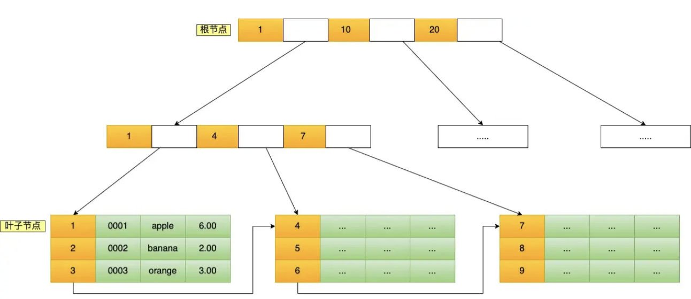
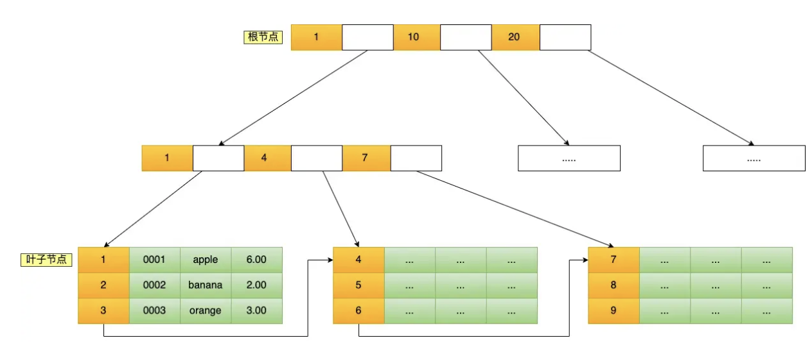

## 索引基础

### 1\. 索引是什么？有什么好处？

索引是一种排好序的帮助数据库快速查找数据的数据结构。MySQL 不需要逐行扫描整张表，而是可以先通过索引定位符合条件的记录，再读取对应的数据。InnoDB 中最常用的索引结构是 B+ 树。

索引的主要好处有：

1.  减少需要扫描的数据量，提高查询效率。
2.  覆盖索引可以直接从索引中获取所需字段，避免回表查询。
3.  主键索引和唯一索引还可以保证字段值的唯一性。

但是索引会占用额外的磁盘空间，插入、更新和删除数据时也需要同步维护索引，从而增加写入成本。索引过多也会增加 redo log 等写入量和优化器选择执行计划的成本，也容易产生重复、冗余索引。

所以索引本质上是用空间和写入成本换取查询性能。

2\. MySQL 索引可以怎么分类？

MySQL 索引通常可以从以下四个角度分类：

1.  **按数据结构分类**：主要有 B+ 树索引、Hash 索引和全文索引。InnoDB 普通索引默认使用 B+ 树；Hash 索引适合等值查询，但不支持范围查询和排序；全文索引用于文本内容检索。
2.  **按物理存储分类**：分为聚簇索引和二级索引。InnoDB 的聚簇索引叶子节点保存完整行数据，一张表只有一个；二级索引叶子节点保存索引列和主键值，查询其他字段时可能需要回表。
3.  **按字段特性分类**：包括主键索引、唯一索引、普通索引和前缀索引。主键索引要求唯一且非空，唯一索引用于保证唯一性，普通索引主要用于提高查询效率，前缀索引只对字符串字段的前若干个字符建立索引。
4.  **按字段数量分类**：分为单列索引和联合索引。联合索引由多个字段组成。

3\. MySQL 如何新建索引？

MySQL 可以使用 `CREATE INDEX` 或 `ALTER TABLE` 创建索引。常用写法如下：

```sql
-- 普通单列索引
CREATE INDEX idx_user_name ON user(name);

-- 联合索引，字段顺序会影响最左前缀匹配
CREATE INDEX idx_user_status_time ON user(status, create_time);

-- 唯一索引
CREATE UNIQUE INDEX uk_user_email ON user(email);

-- 字符串前缀索引
CREATE INDEX idx_user_email_prefix ON user(email(16));

-- 使用 ALTER TABLE 一次添加多个索引
ALTER TABLE user
    ADD INDEX idx_user_phone (phone),
    ADD UNIQUE INDEX uk_user_no (user_no);
```

  

索引数据结构

### 1\. 哈希索引的使用场景是什么？

哈希索引通过哈希函数把索引键映射到对应的存储位置，平均情况下可以用接近 `O(1)` 的时间完成查找，因此适合以等值查询为主的场景，例如 `WHERE id = 100` 或 `WHERE key IN (...)`。

它的典型使用场景是 Memory 存储引擎中的内存表，例如缓存用户的登录状态或权限信息，再通过用户 ID 快速进行等值查询。

哈希索引的局限也比较明显：它不能利用索引完成范围查询、排序和分组，也不支持联合索引的最左前缀匹配；发生哈希冲突时还需要继续比较。因此，如果查询中经常使用 `>`、`<`、`BETWEEN`、`ORDER BY` 或前缀匹配，通常更适合使用 B+ 树索引。

### 2\. MySQL 中的索引是怎么实现的？

MySQL 的索引由存储引擎负责实现，不同引擎可以采用不同的数据结构。以最常用的 InnoDB 为例，普通索引和主键索引默认使用 B+ 树。

B+ 树由根节点、非叶子节点和叶子节点组成。非叶子节点主要保存索引键和子节点指针，不保存完整行数据，因此单个页面可以容纳更多索引项，降低树的高度；叶子节点保存真正的索引记录，并且叶子页之间通过双向链表连接，便于范围查询和排序遍历。

[](../img/innodb-bplus-tree-index-structure.png "InnoDB 的 B+ 树索引结构")

InnoDB 的 B+ 树索引结构

在 InnoDB 中，主键索引是聚簇索引，叶子节点保存完整行数据；二级索引的叶子节点保存索引列和主键值。通过二级索引查询时，先在二级索引 B+ 树中找到主键，再根据主键查询聚簇索引，这就是回表；如果需要的字段都包含在二级索引中，则可以使用覆盖索引直接返回结果。

MyISAM 同样可以使用 B+ 树，但采用非聚簇索引，数据文件和索引文件分开存储。无论主键索引还是普通索引，叶子节点保存的都是数据记录的文件地址，查到地址后再读取对应的行数据。

查询时，MySQL 从根节点开始，根据索引键逐层定位到叶子节点。由于 B+ 树高度通常较低，一次查询只需要访问少量数据页。除 B+ 树外，MySQL 还支持 Hash 索引和全文索引，但适用场景不同。

### 3\. 查询到 B+ 树的叶子节点后，接下来如何查找数据？

到达叶子节点后，InnoDB 先在叶子页内部利用页目录定位记录所在的分组，再在组内比较索引键，找到具体的索引记录。之后的处理取决于使用的索引类型：

-   **聚簇索引查询**：叶子节点保存完整行数据，找到目标记录后可以直接返回需要的字段。
-   **二级索引查询**：叶子节点保存二级索引列和主键值。如果查询字段都在该索引中，就可以通过覆盖索引直接返回；否则需要取得主键值，再查询聚簇索引获取完整行数据，这就是回表。
-   **范围查询**：先定位范围起点，再沿叶子记录以及叶子页之间的双向链表顺序扫描，直到不再满足范围条件。

另外，即使 SQL 使用二级索引，也不一定每条记录都立即单独回表。MySQL 在某些执行计划中可以使用 MRR 等优化，将主键排序或批量读取，以减少随机 I/O。

### 4\. B+ 树的特性是什么？

B+ 树是一种多路平衡查找树，主要有以下特性：

1.  **多路且平衡**：每个节点可以有多个子节点，所有叶子节点位于同一层，因此树的高度较低，查询路径也比较稳定。
2.  **非叶子节点只保存索引键和子节点指针**：不保存完整行数据，所以一个数据页可以容纳更多索引项，提高树的扇出，减少磁盘 I/O。
3.  **数据集中在叶子节点**：查询最终都会到达叶子节点。InnoDB 聚簇索引的叶子节点保存完整行数据，二级索引的叶子节点保存索引列和主键值。
4.  **叶子节点有序连接**：叶子节点中的键值有序，InnoDB 的叶子页之间通过双向链表连接，适合范围查询、排序和顺序遍历。
5.  **增删后仍保持平衡**：插入和删除可能引起节点分裂、合并或重新分配，但树会继续保持平衡，单次查找的时间复杂度通常为 `O(log N)`。

这些特性使 B+ 树既适合等值查询，也适合范围查询，并且能够用较少的数据页访问完成磁盘数据查找。

### 5\. B+ 树和 B 树有什么区别？

1.  **数据存放位置不同**：B 树的非叶子节点和叶子节点都可以保存数据记录；B+ 树的非叶子节点只保存索引键和子节点指针，真正的数据集中在叶子节点。
2.  **查询路径不同**：B 树查到非叶子节点中的目标数据时可以直接返回，不一定到达叶子节点；B+ 树的查询最终都会到达叶子节点，因此查询路径更加稳定。
3.  **树高和磁盘 I/O 不同**：B+ 树非叶子节点不保存完整数据，同样大小的数据页可以容纳更多索引项，扇出更大，树通常更矮，因此查询需要访问的数据页更少。
4.  **范围查询能力不同**：B+ 树的叶子节点有序并通过链表连接，定位起点后可以顺序扫描；B 树的节点之间通常没有这样的叶子链表，范围查询需要反复遍历树结构。
5.  **键值是否重复存储**：B+ 树非叶子节点中的键主要用于导航，相应键值还会出现在叶子节点；B 树中的一个键通常只保存在一个节点中。

因此，B 树适合快速定位单条数据，而 B+ 树在磁盘 I/O、范围查询和顺序遍历方面更有优势，所以 MySQL 的 InnoDB 索引主要使用 B+ 树。

### 6\. B+ 树的好处是什么？

B+ 树的好处主要体现在以下几个方面：

1.  **磁盘 I/O 次数少**：非叶子节点只保存索引键和指针，一个数据页可以容纳更多索引项，树的扇出更大、高度更低，查询时需要读取的数据页更少。
2.  **查询性能稳定**：所有数据都在叶子节点，等值查询最终都会走到叶子层，查询路径长度比较稳定。
3.  **范围查询效率高**：叶子节点中的数据有序，并通过链表相连。找到范围起点后，可以沿叶子节点顺序扫描，不需要重复从根节点查找。
4.  **适合排序和顺序遍历**：索引本身有序，在满足索引顺序的情况下，可以减少额外排序操作。
5.  **适合磁盘分页存储**：B+ 树节点可以对应数据库的数据页，能够充分利用顺序访问和局部性，提高缓存命中率。

因此，B+ 树既能提供较好的等值查询性能，也非常适合数据库常见的范围查询、排序和顺序扫描。

### 7\. B+ 树的叶子节点链表是单向还是双向？

从数据结构定义上说，B+ 树只要求叶子节点按照键值顺序连接，并没有强制必须使用单向链表还是双向链表，具体取决于实现。

在 MySQL 的 InnoDB 中，B+ 树的叶子页之间使用双向链表连接，每个叶子页都保存前一页和后一页的指针。InnoDB 默认的数据页大小是 16 KB。这样既可以向后顺序扫描，也可以向前反向扫描，便于范围查询以及满足升序、降序遍历等需求。

需要注意，叶子页之间是双向链表；而一个数据页内部的记录会按照索引键顺序组织，并通过单向链表连接，同时配合页目录加快页内查找。

### 8\. MySQL 为什么使用 B+ 树作为索引？相比其他结构有什么优点？

MySQL 使用 B+ 树，主要是因为数据库索引存储在磁盘中，需要同时兼顾等值查询、范围查询以及尽量减少磁盘 I/O。

-   **相比 Hash 索引**：Hash 适合等值查询，平均查找速度很快，但不支持范围查询、排序和最左前缀匹配；B+ 树的键值有序，可以同时支持等值查询、范围查询和排序。
-   **相比二叉查找树、AVL 树和红黑树**：这些树每个节点的分支较少，在数据量较大时树会比较高，查询需要访问更多节点和数据页；B+ 树是多路树，扇出大、高度低，磁盘 I/O 次数更少。
-   **相比 B 树**：B 树的非叶子节点也保存数据，单个页面能容纳的索引项更少；B+ 树非叶子节点只保存索引键和指针，扇出更大，而且叶子节点通过链表相连，范围查询更高效。
-   **相比数组或有序文件**：顺序查询虽然方便，但插入和删除可能需要移动大量数据；B+ 树通过节点分裂、合并维持平衡，能够兼顾查询和动态更新。

因此，B+ 树能够以较低且稳定的树高完成查询，并高效支持数据库常见的范围扫描、排序和动态增删，是磁盘索引比较合适的综合选择。

### 9\. 为什么 MySQL 不使用跳表作为索引？

跳表可以通过多级链表实现平均 `O(log N)` 的查询，也支持范围遍历，但 InnoDB 的索引主要存储在磁盘上，B+ 树更符合按页读写的特点。

1.  **磁盘 I/O 更少**：B+ 树一个非叶子节点可以在一个数据页中保存大量索引键和指针，扇出很大，树高通常很低；跳表需要逐层沿指针跳转，可能访问更多离散节点和数据页。
2.  **空间局部性更好**：B+ 树以页为单位连续组织多个索引项，能够充分利用磁盘预读和 Buffer Pool；跳表节点包含多级指针，节点之间相对分散，对磁盘和缓存不够友好。
3.  **性能更稳定**：B+ 树是严格平衡的，查找复杂度稳定在 `O(log N)`；跳表依赖随机层高，平均复杂度是 `O(log N)`，最坏情况下可能退化为 `O(N)`。
4.  **范围查询同样高效**：B+ 树定位范围起点后，可以沿叶子页双向链表顺序扫描，因此跳表在范围查询上的优势并不明显。

跳表结构简单、并发更新方便，适合内存场景，例如 Redis 的有序集合；而 InnoDB 更关注磁盘页利用率、缓存命中率和稳定的 I/O 次数，所以选择 B+ 树更合适。

### 10\. InnoDB 是如何支持范围查找走索引的？

核心原因是 B+ 树中的索引键有序，并且叶子页之间通过双向链表连接。

例如查询 `WHERE id BETWEEN 100 AND 200`，InnoDB 先从根节点逐层查找，在叶子页中定位到第一个满足 `id >= 100` 的记录；然后沿叶子记录和叶子页链表顺序扫描，直到 `id > 200` 为止，不需要对范围内的每个值都从根节点重新查找。

前提是查询条件能够确定索引中的连续区间。联合索引还要符合最左匹配原则；如果对索引列使用不支持索引定位的函数、发生不合适的隐式转换，或者范围过大导致回表成本很高，优化器仍可能选择全表扫描。

### 11\. InnoDB 索引扫描的底层原理是什么？

索引扫描的核心是：先利用 B+ 树定位扫描起点，再按索引顺序读取记录，直到超出扫描范围。

1.  优化器根据查询条件和统计信息选择索引，并计算需要扫描的索引区间。
2.  InnoDB 从根页开始比较索引键，沿非叶子节点的子页指针逐层定位到目标叶子页。
3.  在叶子页内通过页目录缩小范围，再比较记录，找到第一条符合起点条件的索引记录。
4.  等值查询找到目标后即可停止；范围查询则沿页内记录和叶子页链表继续扫描，直到超过结束条件。
5.  如果使用二级索引，叶子记录中可以取得索引列和主键值；字段已被覆盖就直接返回，否则根据主键查询聚簇索引完成回表。

扫描过程中还会进行条件过滤和 MVCC 可见性判断。因此“走了索引”只表示采用了索引访问路径，实际性能仍取决于扫描记录数、回表次数、数据页是否在 Buffer Pool，以及最终返回的数据量。

## 联合索引

### 1\. 联合索引的实现原理是什么？

联合索引是把多个字段组合成一个索引，例如 `(a, b, c)`。在 InnoDB 中，它同样使用一棵 B+ 树，只是树中的索引键由多个字段共同组成。

B+ 树会按照索引字段从左到右进行字典序排序：先比较 `a`，`a` 相同时再比较 `b`，`a`、`b` 都相同时再比较 `c`。因此整棵索引对 `a` 全局有序；在 `a` 相同的范围内，`b` 有序；在 `a`、`b` 都相同的范围内，`c` 有序。

这就是最左匹配原则的基础。查询条件包含 `a`，或者包含连续的左侧字段 `a、b`，通常可以快速确定 B+ 树中的连续范围；如果跳过 `a` 直接查询 `b` 或 `c`，由于它们在整棵索引中不是全局有序的，通常无法通过普通索引查找直接缩小扫描范围。

如果它是 InnoDB 的二级联合索引，叶子节点会保存联合索引字段和主键值。当查询所需字段都在联合索引中时，可以形成覆盖索引，直接返回结果而不需要回表。

### 2\. 创建联合索引时需要注意什么？

创建联合索引时，我主要会注意以下几点：

1.  **根据实际查询设计字段顺序**：优先考虑经常出现在 `WHERE`、`JOIN`、`ORDER BY` 和 `GROUP BY` 中的字段，而不是只看字段本身。联合索引需要遵循最左匹配原则，常用查询应尽量能使用连续的左侧字段。
2.  **合理安排等值和范围条件**：通常把常用的等值查询字段放在范围查询字段前面。联合索引用于确定扫描区间时，遇到范围条件后，右侧字段通常不能继续缩小索引扫描范围，但仍可能通过索引下推进行过滤。
3.  **考虑区分度和过滤效果**：在不影响核心查询模式的前提下，可以把区分度较高、过滤效果较好的字段放在前面，以减少扫描的数据量；但不能脱离最左匹配原则机械地按区分度排序。
4.  **利用覆盖索引**：可以把查询经常返回的少量字段放入联合索引，减少回表；但索引字段不能过多、过长，否则会增加索引空间和写入成本。
5.  **兼顾排序需求**：字段顺序和排序方向满足要求时，MySQL 可以利用索引顺序避免 `filesort`；如果中间字段缺失或排序规则不匹配，可能无法利用索引完成排序。
6.  **避免冗余索引**：已有联合索引 `(a, b)` 时，通常不需要再单独创建 `(a)`；但是否保留其他索引仍要结合查询、覆盖效果和执行计划判断。

最终应使用真实数据和 `EXPLAIN` 验证执行计划，并结合慢查询持续调整，而不是一次性建立大量联合索引。

### 3\. 有联合索引 `(A, B, C)`，查询条件是 `A = ? AND C < ?`，索引怎么走？

这个查询可以使用联合索引中的 `A`，但由于中间缺少 `B` 条件，不能直接利用 `C` 在 B+ 树中确定连续的扫描范围。

原因是联合索引先按 `A` 排序，`A` 相同时再按 `B` 排序，只有 `A、B` 都相同时 `C` 才有序。MySQL 会先通过 `A = ?` 定位并扫描对应的索引范围，再对这些记录判断 `C < ?`。

如果满足索引条件下推的条件，MySQL 可以在存储引擎层直接使用索引中的 `C` 过滤记录，减少回表次数；但 `C` 仍没有参与确定索引的起止范围。如果查询字段全部包含在索引中，还可能通过覆盖索引避免回表。

所以面试时可以回答：`A` 用于索引定位，`B` 缺失导致 `C` 不能用于缩小 B+ 树扫描区间，但 `C` 可能通过索引条件下推参与过滤。最终是否选择该索引，还需要结合数据量、区分度和 `EXPLAIN` 判断。

### 4\. 有联合索引 `(a, b, c)`，查询条件是 `WHERE b > ? AND a = ?`，索引会生效吗？

会生效。虽然 SQL 中 `b` 写在 `a` 前面，但 `WHERE` 条件的书写顺序不决定索引的匹配顺序，MySQL 优化器会根据联合索引顺序进行处理。

联合索引先通过 `a = ?` 定位到 `a` 值相同的索引范围，再在这个范围内利用 `b > ?` 进行范围扫描，因此 `a` 和 `b` 都可以用于确定索引扫描区间。

由于 `b` 是范围条件，如果后面还有针对 `c` 的查询条件，`c` 通常不能继续用于缩小索引的起止范围，但可能通过索引条件下推参与过滤。如果查询所需字段都在联合索引中，还可能形成覆盖索引。

所以结论是：该查询符合最左匹配原则，联合索引能够生效，条件在 SQL 中的先后顺序不影响结果；最终使用情况可以通过 `EXPLAIN` 查看 `key`、`key_len` 和 `Extra` 等信息确认。

### 5\. 有联合索引 `(a, b, c)`，查询条件是 `WHERE a = 2 AND c = 1`，能用到联合索引吗？

能用到联合索引，但主要使用 `a` 来确定索引扫描范围。因为缺少中间字段 `b`，`c` 在 `a` 相同的范围内不是连续有序的，所以不能直接利用 `c` 缩小 B+ 树的扫描区间。

MySQL 会先通过 `a = 2` 找到对应的索引范围，再判断 `c = 1`。如果启用了索引条件下推并且执行计划允许，存储引擎可以直接利用索引中的 `c` 过滤记录，减少回表；如果查询字段都包含在该联合索引中，还可以使用覆盖索引避免回表。

所以不能简单地说 `c` 完全没有使用：`a` 用于索引定位，`c` 可能用于索引下推过滤，但 `c` 不参与确定索引的起止范围。

### 6\. 为什么要遵守最左前缀原则才能利用联合索引？

因为联合索引是按照字段从左到右进行字典序排列的。以索引 `(a, b, c)` 为例，它先按 `a` 排序，`a` 相同时再按 `b` 排序，只有 `a、b` 都相同时，`c` 才有序。

因此，查询 `a = 1 AND b = 2` 可以在 B+ 树中确定一个连续范围；如果跳过 `a` 只查询 `b = 2`，相同的 `b` 会分散在不同的 `a` 区间中，无法直接确定连续的扫描起点和终点，通常只能扫描大量索引记录。

最左前缀原则描述的是能否利用联合索引高效缩小扫描范围，不代表跳过左侧字段后索引一定完全没有作用。MySQL 8.0 在部分场景下可能采用 Skip Scan，后面的字段也可能用于索引条件下推或覆盖查询；是否使用以及是否更快，仍要结合数据分布和 `EXPLAIN` 判断。

### 7\. 范围查询为什么可能导致联合索引后续列无法继续定位？

范围查询通常不会让整个索引失效，而是可能使范围字段右侧的列无法继续缩小 B+ 树的扫描区间。

例如联合索引是 `(a, b, c)`，查询条件为：

```sql
WHERE a = 1 AND b > 10 AND c = 3
```

索引先按 `a` 排序，再按 `b`、`c` 排序。通过 `a = 1 AND b > 10` 可以确定一个连续范围，但在这个范围内存在许多不同的 `b` 值，`c` 只在 `a、b` 都相同时才有序，所以不能再用 `c = 3` 直接缩小扫描起止位置。

不过 `c` 不一定完全没用，它可能通过索引条件下推在存储引擎层过滤记录，减少回表。还要注意，`>=`、`BETWEEN` 或前缀 `LIKE 'abc%'` 是否影响后续列，要看它们最终形成的索引区间；不能机械地认为出现范围符号后所有右侧列都失效。如果范围命中数据过多，优化器也可能因成本更低而选择全表扫描。

## 索引存储结构

### 1\. MySQL 聚簇索引和非聚簇索引有什么区别？

核心区别是 B+ 树叶子节点保存的内容不同。

-   **聚簇索引**：叶子节点直接保存完整行数据。InnoDB 通常按主键组织聚簇索引，因此通过主键找到叶子记录后就能取得整行数据。一张表的数据只能按一种顺序组织，所以只能有一个聚簇索引。
-   **非聚簇索引**：索引与完整行数据分开。InnoDB 的二级索引叶子节点保存“索引列 + 主键值”；查询其他字段时，需要拿主键再查聚簇索引，这就是回表。如果查询字段都在二级索引中，则可以通过覆盖索引直接返回。

如果 InnoDB 表没有显式主键，会选择第一个非空唯一索引作为聚簇索引；仍没有时会生成隐藏行 ID。MyISAM 则采用非聚簇存储，索引叶子节点保存数据文件地址。

因此，InnoDB 主键查询通常只查一棵 B+ 树，二级索引查询可能需要查两棵。由于所有二级索引都会保存主键值，主键应尽量短、稳定，避免放大索引空间和更新成本。

### 2\. 如果聚簇索引中的数据更新，存储结构要发生变化吗？

要看更新的是普通字段还是聚簇索引键，也就是 InnoDB 中通常所说的主键。

-   **更新普通字段**：聚簇索引的叶子节点保存完整行数据，所以记录内容会被修改。如果字段长度变化后当前数据页空间不足，记录可能发生页内移动，甚至引起页分裂；但记录在 B+ 树中的排序位置通常不变。
-   **更新主键字段**：由于聚簇索引按照主键排序，主键变化可能导致记录的排序位置改变。InnoDB 通常需要删除旧索引记录，再把记录插入新的位置；同时，二级索引叶子节点保存的是主键值，因此相关二级索引也需要更新。

所以更新主键的成本通常比更新普通字段高，还可能带来页分裂和更多索引维护。实际设计中，主键应该尽量保持稳定，业务中一般不建议修改主键。

### 3\. MySQL 主键是聚簇索引吗？

不能一概而论，要看使用的存储引擎。

在 InnoDB 中，主键索引就是聚簇索引，B+ 树的叶子节点保存完整的行数据。如果表没有显式主键，InnoDB 会选择第一个非空唯一索引作为聚簇索引；如果仍然没有，就自动生成一个隐藏的行 ID。因此，InnoDB 表一定有聚簇索引，但这个聚簇索引不一定是用户显式定义的主键。

[](../img/innodb-clustered-index-bplus-tree.png "InnoDB 聚簇索引的 B+ 树结构")

InnoDB 聚簇索引的 B+ 树结构

一张 InnoDB 表只能有一个聚簇索引，其他索引都属于二级索引或辅助索引。二级索引同样使用 B+ 树，但叶子节点通常保存索引列和聚簇索引键；需要查询其他字段时，再根据聚簇索引键回表获取完整行数据。

在 MyISAM 中，索引和数据分开存储，主键索引的叶子节点保存的是数据记录的文件地址，因此主键索引属于非聚簇索引。

所以面试时可以回答：InnoDB 的主键是聚簇索引，而 MyISAM 的主键不是；“主键是否为聚簇索引”取决于存储引擎。

## 主键设计

### 1\. 什么字段适合作为主键？

适合作为主键的字段通常应该满足以下特点：

1.  **唯一且非空**：能够唯一标识一条记录，这是主键最基本的要求。
2.  **稳定不变**：主键更新可能导致聚簇索引中的记录移动，并更新相关二级索引，所以不应该选择经常变化的业务字段。
3.  **长度较短**：InnoDB 的二级索引叶子节点会保存主键值，主键越大，所有二级索引占用的空间也越大。
4.  **尽量有序递增**：递增主键通常在 B+ 树末尾顺序写入，可以减少随机插入、页分裂和数据碎片。
5.  **尽量不包含业务含义**：手机号、身份证号、用户名等业务字段可能发生变化，而且可能涉及隐私，不适合直接作为主键。

因此，单机或普通业务表通常使用 `BIGINT UNSIGNED AUTO_INCREMENT` 作为主键。分布式系统中，多台服务器各自生成自增 ID 可能发生冲突，可以使用雪花算法等生成全局唯一、趋势递增的整数 ID。一般不建议直接使用随机 UUID 字符串作为 InnoDB 主键，因为它较长且无序，容易增加索引空间和页分裂；如果必须使用 UUID，可以考虑有序 UUID，并采用更紧凑的二进制形式存储。

### 2\. 表中有十个字段，主键使用自增 ID 还是 UUID？为什么？

如果是普通单库业务，我会优先使用 `BIGINT UNSIGNED AUTO_INCREMENT`，而不是随机 UUID。

InnoDB 使用主键作为聚簇索引。自增 ID 短小且有序，新记录通常顺序写入 B+ 树末尾，可以减少随机 I/O、页分裂和数据碎片；同时，二级索引叶子节点会保存主键值，8 字节的 `BIGINT` 也能减少二级索引占用的空间。

随机 UUID 虽然能够在不同节点独立生成，具有全局唯一性，也不容易暴露业务数据量，但它通常较长且无序。作为聚簇索引键时，新记录可能被插入 B+ 树的不同数据页；如果目标页不在 Buffer Pool 中，还会增加随机磁盘 I/O。频繁的随机插入也容易引起页分裂、数据移动和索引碎片，降低空间利用率；如果使用 `CHAR(36)` 存储，还会明显增大聚簇索引和所有二级索引。

如果业务是分布式系统，需要多节点独立生成 ID，我会选择雪花 ID、UUIDv7 等全局唯一且趋势递增的方案。如果必须使用 UUID，也会优先使用 `BINARY(16)`，而不是 `CHAR(36)`。所以最终不是看表有几个字段，而是看系统架构、主键生成方式和索引性能要求。

### 3\. 为什么自增 ID 更快？UUID 在 B+ 树中不是有序存储的吗？

UUID 在 B+ 树中最终当然也是按照键值有序存储的，因为 B+ 树本身必须保持有序。区别不在最终结果是否有序，而在新主键的生成顺序和插入位置。

自增 ID 单调递增，新记录通常可以追加到 B+ 树最右侧的叶子节点，写入位置集中，缓存命中率较高，也能减少随机 I/O、页分裂和索引碎片。

随机 UUID，例如 UUIDv4，生成顺序与键值顺序没有关系。每次插入都可能定位到不同的数据页；为了保持 B+ 树有序，InnoDB 可能需要加载目标页、移动记录或分裂数据页，所以写入成本通常更高。此外，UUID 比 `BIGINT` 更大，而 InnoDB 的二级索引会保存主键值，因此 UUID 还会增加所有二级索引的空间和比较成本。

索引页大小是固定的，主键越大，一个页面能够容纳的索引项就越少，B+ 树的扇出会降低。在数据量足够大时，这可能让树变得更高，查询需要访问更多页面。若使用 `CHAR(36)` 保存 UUID，字符串比较本身也比整数比较更复杂；因此 UUID 更适合使用 `BINARY(16)` 紧凑存储。

这并不表示 UUID 查询一定很慢。使用索引进行单条等值查询时，两者都是通过 B+ 树查找；主要差异通常体现在写入、缓存利用率和索引体积上。如果需要全局唯一 ID，可以选择雪花 ID、UUIDv7 等趋势递增方案，并使用 `BINARY(16)` 紧凑存储 UUID。

## 索引设计与优化

### 1\. 性别字段能加索引吗？为什么？

性别字段在语法上当然可以加索引，但通常不适合单独建立普通索引，因为它的取值很少、区分度低。按性别查询往往会命中表中很大比例的数据，即使通过索引找到主键，仍需要进行大量回表操作，成本可能比全表扫描更高，因此优化器可能不会选择该索引。

字段区分度可以用 `COUNT(DISTINCT sex) / COUNT(*)` 粗略衡量，结果越接近 `1`，区分度通常越高。性别字段只有少量取值，在数据量很大时区分度会非常低。此时并不是索引“失效”了，而是优化器估算走索引并大量回表的成本更高，所以选择全表扫描。

不过也不能一概而论。如果数据分布严重倾斜，而查询的恰好是占比很小的值，索引可能有效；或者性别字段与其他高区分度、常用于查询的字段组成联合索引，并且符合最左匹配原则，也可能提升查询效率。若联合索引能够覆盖查询所需字段，还可以避免回表。

所以是否建立索引要看字段基数、数据分布、查询条件和返回数据量，不能只根据字段名称判断。实际项目中应结合慢查询和 `EXPLAIN` 的执行计划验证。

### 2\. 常见的索引失效场景有哪些？

常见的索引失效或未被优化器选择的场景主要有：

1.  **不满足最左匹配原则**：联合索引 `(a, b, c)` 跳过 `a`，直接按 `b` 或 `c` 查询，通常无法利用该索引快速定位范围。
2.  **对索引列使用函数或表达式**：例如 `WHERE YEAR(create_time) = 2026`、`WHERE age + 1 = 20`，普通索引保存的是原始列值，通常无法直接匹配；可以改写条件或使用函数索引。
3.  **发生隐式类型转换**：例如字符串字段使用数字条件比较，可能对索引列进行类型转换，导致无法正常使用索引。参数类型应与字段类型保持一致。
4.  **使用前导模糊匹配**：`LIKE '%abc'` 或 `LIKE '%abc%'` 无法根据字符串前缀定位 B+ 树范围；`LIKE 'abc%'` 通常可以使用索引。
5.  **`OR` 条件中的部分字段没有合适索引**：优化器可能选择全表扫描；是否能够使用索引合并也要看具体执行成本。
6.  **联合索引遇到范围条件**：用于构造扫描区间时，范围字段右侧的列通常不能继续缩小索引范围，但可能通过索引条件下推参与过滤。
7.  **索引区分度低或返回数据过多**：即使语法上可以使用索引，如果需要读取表中很大比例的数据并大量回表，优化器也可能认为全表扫描成本更低。
8.  **排序或分组不符合索引顺序**：字段顺序、方向或中间缺少必要条件时，索引可能无法消除额外排序或临时表。

需要注意，`!=`、`NOT IN`、`IS NULL` 等写法并不一定导致索引失效，是否使用索引取决于数据分布和执行成本。实际排查时应使用 `EXPLAIN` 或 `EXPLAIN ANALYZE` 查看 `key`、`type`、`rows` 和 `Extra`，不能只凭 SQL 写法判断。

### 3\. 一个字段既有单列索引，又是联合索引的最左列，单独查询它时会走哪个索引？

没有固定答案，MySQL 的成本优化器会根据索引统计信息、选择性、索引大小、预计扫描行数、是否需要回表以及能否覆盖查询等因素，选择成本较低的执行计划。

例如字段 `a` 同时存在单列索引 `(a)` 和联合索引 `(a, b)`，执行 `WHERE a = ?` 时两个索引都符合最左匹配原则。一般情况下，单列索引更窄，同一个数据页能容纳更多索引项，扫描成本可能更低，因此更容易被选择；但如果查询还需要返回 `b`，联合索引 `(a, b)` 可以形成覆盖索引、避免回表，优化器就可能选择联合索引。

如果两个索引长期服务于相同查询，单列索引可能属于冗余索引，但删除前要确认它是否还服务于其他查询，以及联合索引增大的扫描成本。实际使用哪个索引应通过 `EXPLAIN` 或 `EXPLAIN ANALYZE` 查看，必要时更新统计信息，而不应该只根据建索引的先后顺序判断。

### 4\. 索引字段是不是建得越多越好？

不是。索引可以提高部分查询速度，但索引越多，带来的维护成本也越高。

1.  **降低写入性能**：插入、删除以及更新索引字段时，都需要同步维护相关 B+ 树，可能产生更多页分裂、日志和磁盘 I/O。
2.  **占用更多存储空间**：每个索引都需要独立的索引页，InnoDB 二级索引还会保存主键值，索引过多会显著增大磁盘和 Buffer Pool 的占用。
3.  **增加优化器选择成本**：候选索引过多会增加执行计划的评估成本，统计信息不准确时还可能选到不理想的索引。
4.  **容易产生重复或冗余索引**：例如已有联合索引 `(a, b)` 时，索引 `(a)` 在很多场景下可能是冗余的；多个高度相似的索引也会重复消耗空间和写入成本。
5.  **低区分度索引收益有限**：如果字段取值很少，查询又会返回大量数据，优化器可能直接选择全表扫描，建立索引也未必有实际收益。

所以索引应该围绕高频查询、连接、排序和分组场景设计，并优先考虑合理的联合索引和覆盖索引。建立后还要结合慢查询、`EXPLAIN` 和索引使用情况，定期清理无效或重复索引。

### 5\. `status` 字段只有 0 和 1，适合建立索引吗？

通常不建议只给 `status` 单独建立普通索引，因为它只有两个取值，区分度很低。如果查询会命中表中很大比例的数据，走二级索引还需要大量回表，成本可能比全表扫描更高，优化器往往不会选择这个索引。

但也有适合建索引的情况。例如大部分记录的 `status` 都是 1，只有极少数是 0，而业务经常查询 `status = 0`，那么索引可以快速定位这部分少量数据。另一个常见做法是把 `status` 与用户 ID、时间等高频查询字段组成联合索引，例如 `(status, create_time)`，同时兼顾过滤和排序；如果查询字段都包含在索引中，还可以形成覆盖索引，避免回表。

所以不能只看字段有几个取值，还要看数据分布、查询频率、返回数据比例和是否需要回表。最终应使用真实数据配合 `EXPLAIN` 或 `EXPLAIN ANALYZE` 验证。

### 6\. 怎么决定建立哪些索引？

我通常会根据真实的查询和数据分布来设计索引，主要步骤是：

1.  **先找高频和慢查询**：通过业务访问路径、慢查询日志定位经常执行且耗时较高的 SQL，优先优化核心查询，而不是给所有字段都建索引。
2.  **分析查询条件**：重点关注 `WHERE`、`JOIN ON` 中经常用于过滤和关联的字段，以及 `ORDER BY`、`GROUP BY` 中需要排序或分组的字段。
3.  **评估区分度和返回比例**：优先考虑区分度高、过滤效果好的字段。低区分度字段只有在数据严重倾斜、查询少量值或参与联合索引时才可能有较高收益。
4.  **合理设计联合索引顺序**：根据最左匹配原则，把常用的等值条件放在前面，范围条件通常放在后面，同时兼顾排序、分组和多条核心 SQL，不能只机械地按区分度排列。
5.  **适当使用覆盖索引**：将查询经常返回的少量字段放入联合索引，减少回表；但索引不能过宽，否则会增加空间和写入维护成本。
6.  **控制索引数量**：避免重复、冗余和长期不用的索引。数据量很小的表，全表扫描可能已经足够快；频繁更新的字段会增加 B+ 树、日志和锁等维护成本，也要谨慎建立索引。写入频繁的表尤其需要权衡查询收益与插入、更新、删除的开销。
7.  **用执行计划验证**：建立索引后使用 `EXPLAIN` 或 `EXPLAIN ANALYZE` 查看实际使用的索引、扫描行数和回表情况，再结合慢查询效果持续调整。

所以建立索引不是只看单个字段，而是要综合 SQL 模式、字段顺序、数据分布、读写比例和维护成本。

### 7\. 索引优化可以从哪些方面进行？

索引优化不能只看有没有索引，我通常会按照以下步骤处理：

1.  **定位慢 SQL**：先通过慢查询日志、监控和业务调用链找到执行频率高或耗时长的 SQL，确认问题是扫描行数过多、回表过多、排序还是锁等待。
2.  **分析执行计划**：使用 `EXPLAIN` 或 `EXPLAIN ANALYZE`，重点查看 `type`、`key`、`key_len`、`rows`、`filtered` 和 `Extra`，判断实际走了哪个索引，是否出现全表扫描、临时表、额外排序或大量回表。
3.  **建立合适的联合索引**：根据 `WHERE`、`JOIN`、`ORDER BY` 和 `GROUP BY` 设计字段顺序，遵循最左匹配原则；常用等值条件通常放在范围条件前，同时兼顾字段区分度和核心查询模式。
4.  **使用覆盖索引**：让条件字段和少量返回字段包含在同一个索引中，减少回表。但不能盲目把所有查询列都放入索引，否则索引会过宽。
5.  **避免索引无法有效使用**：尽量不要对索引列使用函数或表达式，避免不必要的隐式类型转换和前导 `%` 模糊查询；联合索引不要跳过最左字段。
6.  **优化排序和分页**：让过滤条件与排序字段尽量符合联合索引顺序，减少 `filesort`。深分页可以先通过索引记录上次位置，再使用 `WHERE id > ? LIMIT ?`，避免扫描并丢弃大量记录。
7.  **控制索引数量和大小**：删除重复、冗余及长期未使用的索引，选择短小、稳定的主键，避免随机且过长的主键放大所有二级索引；写多读少的表尤其要控制索引数量。
8.  **维护统计信息并持续验证**：数据分布发生较大变化时及时更新统计信息。优化后要在接近真实的数据量和参数下验证响应时间、扫描行数与写入开销，不能只看是否显示“走了索引”。

最终目标不是让所有 SQL 都使用索引，而是让优化器以更低的整体成本读取更少的数据页和记录，同时兼顾写入性能与存储成本。

### 8\. 了解过前缀索引吗？

前缀索引是只对字符串字段的前若干个字符建立索引，而不是索引整个字段，适合较长的 `VARCHAR`、`TEXT` 等类型。创建方式例如：

```sql
CREATE INDEX idx_email_prefix ON user(email(10));
```

它的优点是可以减小索引体积，让一个数据页容纳更多索引项，从而降低存储和缓存开销；如果字段前缀本身区分度较高，也能取得接近完整字段索引的过滤效果。

前缀长度需要在区分度和空间之间权衡，可以比较不同长度的选择性，例如：

```sql
SELECT
    COUNT(DISTINCT LEFT(email, 10)) / COUNT(*) AS selectivity
FROM user;
```

前缀索引也有局限：它不能保存字段的完整值，查询完整字段时通常仍需要回表；对完整字段的排序和分组能力也会受限；如果查询使用前导通配符，例如 `LIKE '%abc'`，仍然不能有效利用普通前缀索引。另外，唯一前缀索引保证的是指定前缀唯一，不等同于只比较完整字符串后再保证唯一。

所以前缀索引适合字段较长、前若干个字符区分度较高，并且查询主要按前缀匹配的场景。

### 9\. `ORDER BY` 为什么可能无法利用索引排序？

`ORDER BY` 通常不会让 `WHERE` 条件使用的索引整体失效，而是排序顺序与索引顺序不一致时，MySQL 无法直接按索引顺序返回结果，只能额外执行 `filesort`。

常见原因有：

1.  排序字段不符合联合索引的最左前缀，例如索引是 `(a, b)`，却直接执行 `ORDER BY b`。
2.  前导列没有固定，例如 `WHERE a > 10 ORDER BY b` 中存在多个 `a` 值，`b` 在整个扫描范围内不是全局有序的。
3.  多个排序字段的顺序或升降序方向与索引定义不兼容。
4.  对排序列使用函数、表达式或不同的排序规则，无法直接利用原索引顺序。
5.  即使索引能够排序，优化器也可能因为扫描、回表成本过高而选择其他索引加 `filesort`。

例如索引 `(a, b)` 配合 `WHERE a = 1 ORDER BY b`，`a` 被固定后，`b` 在该区间内有序，通常可以利用索引完成排序。最终应通过 `EXPLAIN` 查看 `key` 和 `Extra`，而且出现 `Using filesort` 不代表一定很慢，还要结合参与排序的数据量判断。

### 10\. 为什么对索引字段进行操作可能导致索引失效？

因为普通 B+ 树索引保存的是字段原始值，并按照原始值排序。查询条件如果变成 `函数(字段)` 或 `字段 + 运算`，MySQL 往往无法根据运算后的结果直接推导出原始索引中的连续起止范围，只能逐条计算和比较。

例如 `age` 上有普通索引：

```sql
WHERE age + 1 = 20
```

B+ 树中保存的是 `age`，不是 `age + 1`，因此可能无法直接定位；改写为 `WHERE age = 19` 后，就能按原始索引值查找。同理，`WHERE DATE(create_time) = '2026-08-19'` 通常应改写成左闭右开的时间范围。

这不是所有操作都一定导致索引失效，优化器能够等价改写的表达式仍可能使用索引。MySQL 8.0.13 及以后还可以使用函数索引，或者对生成列建立索引，让表达式结果本身有序存储。最终应通过 `EXPLAIN` 查看实际执行计划。

## 回表与覆盖索引

### 1\. 什么情况下会发生回表查询？

在 InnoDB 中，通过二级索引查询时，如果二级索引中没有包含查询所需的全部字段，就会发生回表。

二级索引的叶子节点通常只保存二级索引列和主键值。MySQL 先通过二级索引找到符合条件记录的主键，再根据主键查询聚簇索引，获取完整行数据，这个过程就是回表。

例如表上有索引 `idx_name(name)`，执行 `SELECT age FROM user WHERE name = 'Tom'` 时，索引中没有 `age`，因此需要根据主键回表查询；如果执行 `SELECT id, name FROM user WHERE name = 'Tom'`，由于二级索引中已有 `name` 和主键 `id`，通常可以直接返回，不需要回表。

直接使用主键查询时，聚簇索引叶子节点已经保存完整行数据，不需要再次回表。减少回表的常见方法是建立合适的联合索引，让查询需要的字段都包含在索引中，形成覆盖索引；但也不能为了避免回表而建立过宽的索引，否则会增加存储空间和写入维护成本。

### 2\. 什么是覆盖索引？底层原理是什么？

覆盖索引不是一种单独的索引类型，而是某个索引包含了查询所需的全部字段，包括过滤、关联、排序以及返回字段，因此可以直接从索引中得到结果，不需要回表。

例如有联合索引 `idx_name_age(name, age)`，执行下面的查询：

```sql
SELECT age
FROM user
WHERE name = 'Tom';
```

底层原因是 InnoDB 二级索引的叶子节点保存“二级索引列 + 主键值”。执行器扫描 `idx_name_age` 时，已经能从叶子节点取得 `name` 和 `age`，所以可以直接返回；如果还要查询索引中不存在的字段，就必须取出主键，再到聚簇索引中查找完整行，这才会发生回表。

覆盖索引能够减少随机回表和数据页读取。在 `EXPLAIN` 中，`Extra` 出现 `Using index` 通常表示使用了覆盖索引。不过不能为了覆盖查询而无限增加索引列，否则会增大索引体积，并提高写入维护成本。

## 索引维护

### 1\. 索引已经建好，再插入一条数据时索引会发生哪些变化？

插入一条数据时，InnoDB 不仅要写入记录，还要同步维护该表上的所有相关索引：

1.  **更新聚簇索引**：InnoDB 根据主键值在聚簇索引 B+ 树中找到对应的叶子页，把完整行数据插入合适位置。自增主键通常追加到最右侧叶子页，随机主键则可能插入树的中间位置。
2.  **更新二级索引**：每个相关二级索引都要新增一条由“二级索引列 + 主键值”组成的索引记录。如果存在唯一索引，还需要检查是否违反唯一约束。
3.  **可能发生页分裂**：如果目标数据页空间不足，InnoDB 需要分裂页面并重新分配记录，同时更新父节点中的索引信息；分裂继续向上传递时，树高也可能增加。
4.  **记录事务日志**：插入过程会产生 undo log，用于事务回滚和 MVCC；同时产生 redo log，用于保证持久性和崩溃恢复。实际数据页通常先在 Buffer Pool 中修改，之后再刷盘。

所以索引越多，插入时需要维护的 B+ 树越多，写入成本、日志量和存储空间也会增加。这也是为什么索引不是越多越好，以及主键通常应尽量短小、有序。

### 2\. InnoDB 中的 B+ 树是怎么产生的？

InnoDB 的 B+ 树是随着数据插入逐步生长出来的，基本单位是数据页，默认大小通常为 16 KB。

刚开始数据较少时，根节点本身就是叶子页，记录按照索引键有序存放。当这个页写满后，InnoDB 会申请新页，将记录拆分到不同页中，并在上层节点保存索引键和子页指针。叶子页继续写满就继续分裂；如果上层节点也满了，同样向上分裂，必要时增加树的高度。

最终，非叶子节点负责导航，叶子节点保存真正的索引记录，叶子页之间通过双向链表连接。聚簇索引的叶子节点保存完整行数据，二级索引的叶子节点保存索引列和主键值。
